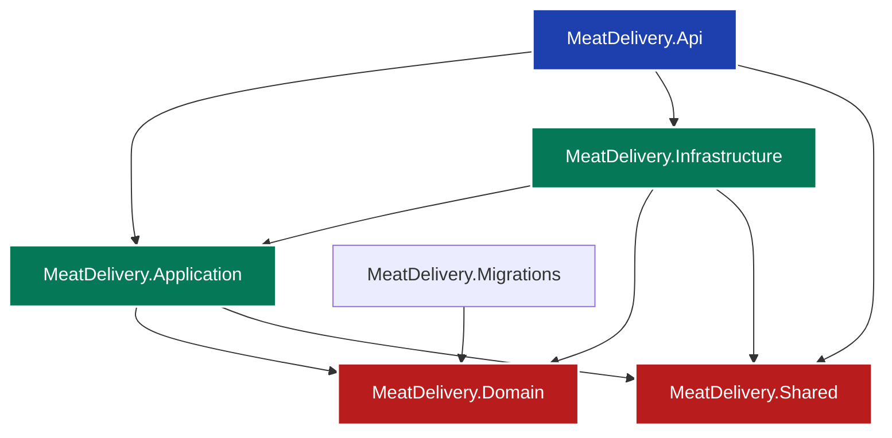
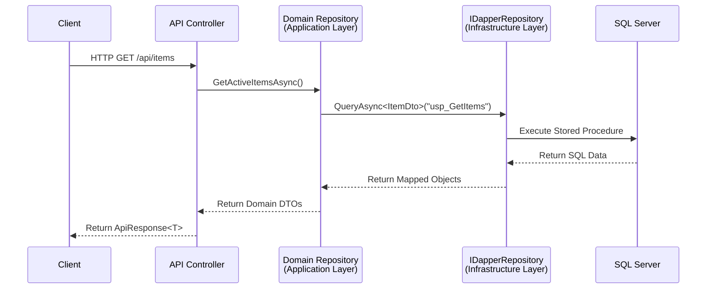

# MeatDelivery POS SaaS - API Architecture

Welcome to the **MeatDelivery POS (Point of Sale) SaaS** backend repository. This project is built using a modern, scalable **Clean Architecture** pattern on .NET 10. It is designed to support a multi-tenant SaaS environment, utilizing Dapper for high-performance database interactions and JWT for robust authentication.

---

## 🏗️ Solution Overview

The solution is divided into several meticulously separated projects to enforce the **Dependency Inversion Principle**. This ensures that the core business logic remains independent of UI, databases, or external frameworks.



### 📦 Project Descriptions

1. **`MeatDelivery.Api`** (Presentation Layer)
   - The entry point of the application.
   - Contains Controllers, Middlewares (e.g., TenantResolver), and API-specific configurations like Swagger and DI wire-ups.
   - Responsible strictly for HTTP request routing and returning standardized responses.

2. **`MeatDelivery.Application`** (Application Layer)
   - Contains the core use cases of the system.
   - Defines **Interfaces** (`IAuthenticationService`, `ITestRepository`, `IDapperRepository`) and **DTOs** (Data Transfer Objects).
   - This layer dictates *what* the system can do without caring *how* it's done.

3. **`MeatDelivery.Domain`** (Domain Layer)
   - The heart of the software. Contains enterprise-wide logic, domain entities, and core business rules.
   - Completely isolated and has zero dependencies on external frameworks or databases.

4. **`MeatDelivery.Infrastructure`** (Infrastructure Layer)
   - Implements the interfaces defined in the Application layer.
   - Contains data access logic (Dapper wrappers, SQL execution), Authentication mechanisms (BCrypt hashing, JWT generation), and Multi-tenancy resolution logic.
   - Communicates directly with the SQL Server database.

5. **`MeatDelivery.Shared`** (Shared Kernel)
   - Contains common constants, standardized response wrappers (`ApiResponse<T>`), and generic utilities used across all layers.

6. **`MeatDelivery.Migrations`** (Database Migrations)
   - A standalone console application responsible for executing database schema changes.
   - Uses `FluentMigrator` and raw SQL scripts to manage Control and Tenant databases.

---

## 🔄 Standard Architecture Flow

To maintain a clean and testable codebase, the API strictly enforces a unidirectional data flow. **Controllers never interact with the database directly.**



### The Rules of Data Access:
1. **Controller**: Handles HTTP request, extracts JWT claims, maps to Application DTOs. Injects specific Domain Repositories (e.g., `IUserRepository`).
2. **Domain Repository**: Implemented in Infrastructure. Knows the exact Stored Procedure names and SQL parameters. Injects the generic `IDapperRepository`.
3. **IDapperRepository**: The only class that actually opens SQL connections and executes Dapper queries.

---

## 💬 API Response Format

Every API endpoint arily arily returns data using the `BaseApiController`, ensuring front-end clients receive a consistent structure via the `ApiResponse<T>` wrapper.

**Success Response (200 OK / 201 Created)**
```json
{
  "success": true,
  "message": "Data retrieved successfully.",
  "data": {
    "id": 1,
    "name": "Sample Data"
  },
  "errors": null,
  "traceId": "0HN1A2B3C4D5E:00000001"
}
```

**Failure Response (400 Bad Request / 404 Not Found)**
```json
{
  "success": false,
  "message": "Validation failed.",
  "data": null,
  "errors": [
    "Name cannot be empty.",
    "Route ID does not match Body ID."
  ],
  "traceId": "0HN1A2B3C4D5E:00000002"
}
```

---

## 🔐 Authentication & Authorization

The platform utilizes **JWT (JSON Web Tokens)** alongside a highly secure Refresh Token rotation strategy. Passwords are cryptographically hashed using **BCrypt** with unique salts.

### Authentication Flow
- **Login**: Validates BCrypt hash, issues a short-lived `AccessToken` and a long-lived `RefreshToken` stored in the database.
- **Refresh**: Accepts an expired `AccessToken` and a valid `RefreshToken`, revokes the old refresh token, and issues a completely new token pair.
- **Logout**: Extracts the user's ID from claims and revokes the specific `RefreshToken`.

### Authorization Levels
The system supports multiple tiers of granular authorization using ASP.NET Core Policies. You can apply these attributes directly to Controller actions:

1. **Unauthenticated** (`[AllowAnonymous]`): Public endpoints like Login or Register.
2. **Basic Authentication** (`[Authorize]`): Requires any valid JWT.
3. **Role-Based** (`[Authorize(Roles = "Admin")]`): Restricts based on the standard `ClaimTypes.Role` injected into the token.
4. **Policy & Permission-Based** (`[Authorize(Policy = "CanManageUsers")]`): The recommended approach. Checks for specific granular permission claims (e.g., `permission: users.manage`) attached to the user's role.
5. **Tenant-Aware** (`[Authorize(Policy = "RequireTenantAccess")]`): Ensures the user belongs to the current subdomain/tenant environment.

---

## 🗄️ Database Strategy

All database schema modifications are managed via the `MeatDelivery.Migrations` project.
- **Zero ORM Magic**: The application deliberately avoids complex ORMs like Entity Framework in favor of high-performance **Dapper**.
- **Stored Procedures**: All logic that reads or mutates data is executed via secure SQL Stored Procedures to prevent SQL injection and centralize query logic.
- **Multi-Result Sets**: Utilizing `QueryMultipleAsync`, the system can efficiently load a User, their Roles, and their Permissions in a single database round-trip.

---

## 🚀 Getting Started

1. **Configure Database**: Ensure your SQL Server connection strings are updated in `appsettings.json`.
2. **Run Migrations**: Execute the `MeatDelivery.Migrations` project to seed the ControlDb and TenantDb. Default Admin credentials are `admin` / `Admin123!`.
3. **Run API**: Start the `MeatDelivery.Api` project. The Swagger UI will be automatically available in the development environment to test endpoints.

# al_azima_backend
